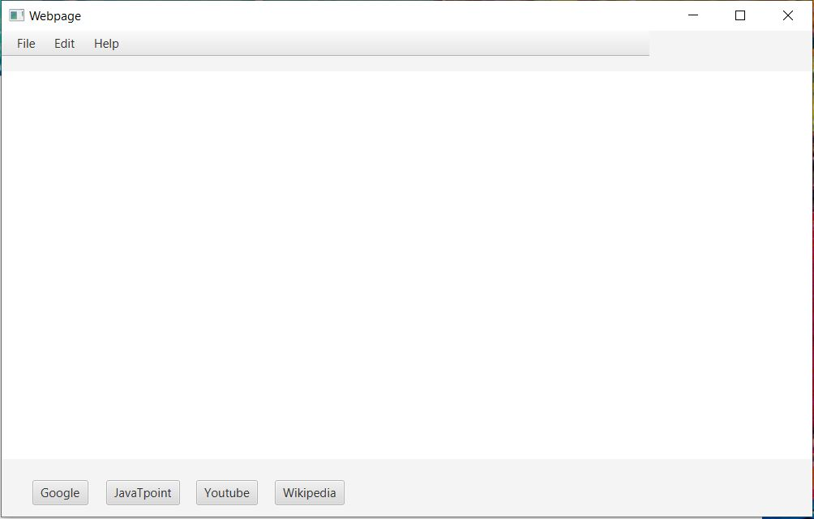
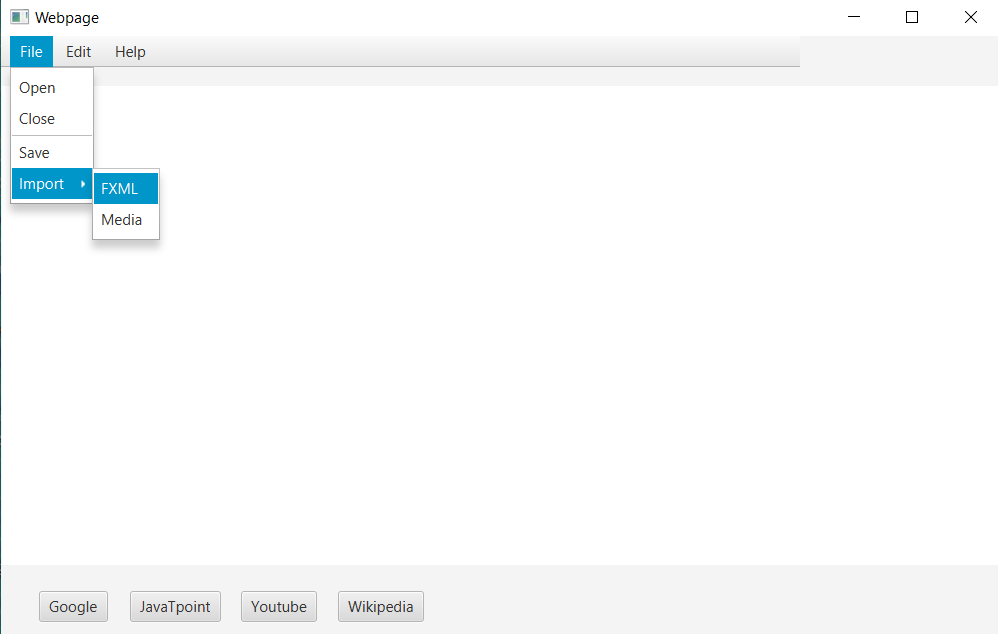
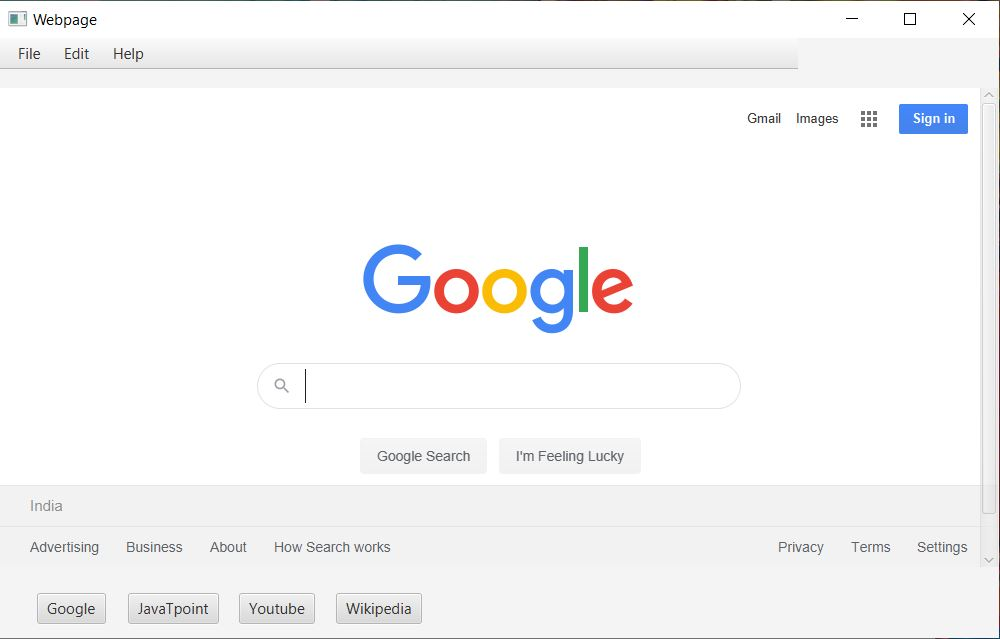
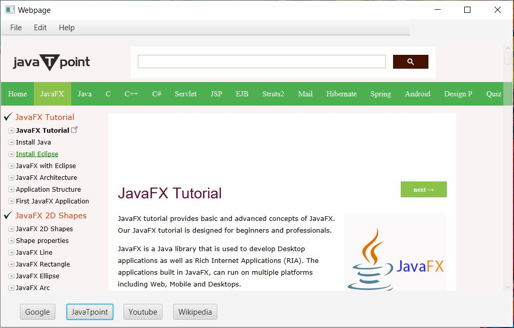
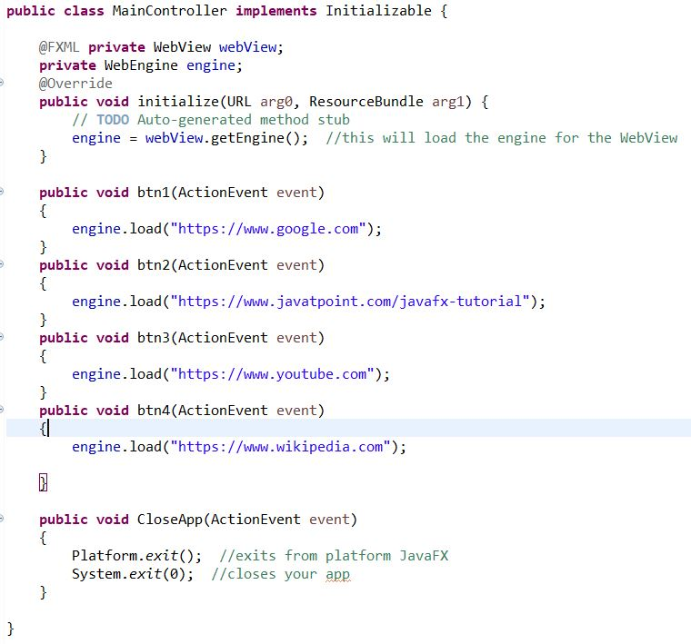

# Basic Webpage

A Basic Webpage built using JavaFX.

The FXML files have been designed using SceneBuilder.

The webpage comprises of Menubar, Menuitems, Menu inside Menu,Separator Line, Webview, Buttons.

There are linked events and controls as well.

**On clicking Close Button under the File option, the Webpage will be closed.**

**Initial View of Webpage:**

**On clicking Google, 'Google' will be opened.**

**On clicking JavaTpoint, 'JavaTpoint JavaFX tutorial' will be opened.**

Similarly , on clicking other buttons , the respective sites will be opened.

**Code Snippet:**

In this webpage, you can add more buttons which redirect to different websites. Also, you an use different options provided by the engine such as:

engine.executeScript("Here you can execute Javascript")

engine.loadContent("html code can be executed here")

engine.reload(); // to reload webpage

engine.getHistory()

engine.getLocation()

and many more.
