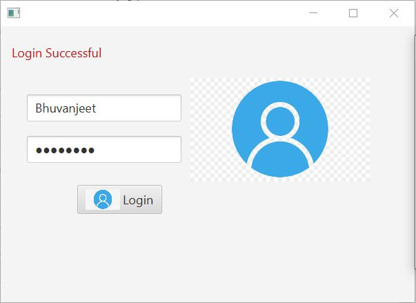
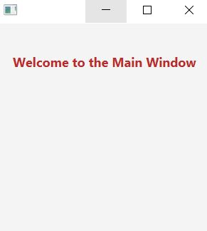
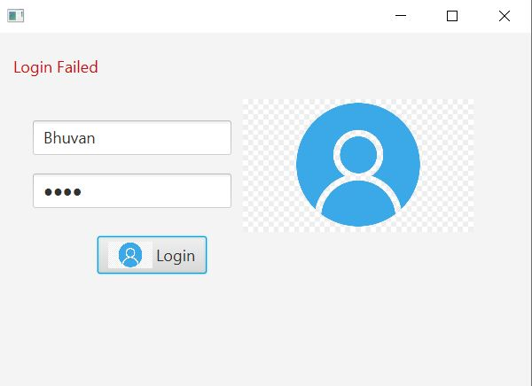
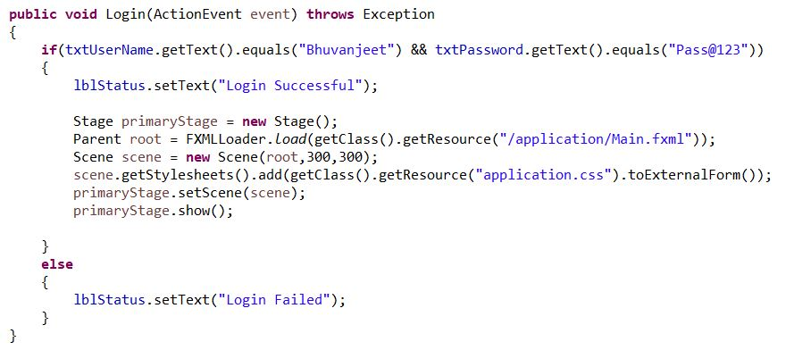

# Login Application

A simple Login Application made using JavaFX.

The FXML files have been designed using SceneBuilder.

## Login Window :

Correct Username : Bhuvanjeet

Correct Password : Pass@123

On successful login :

In case of unsuccessful login :

## Code Snippet :

The correct Username and Password can be set by changing it in void Login() function.
