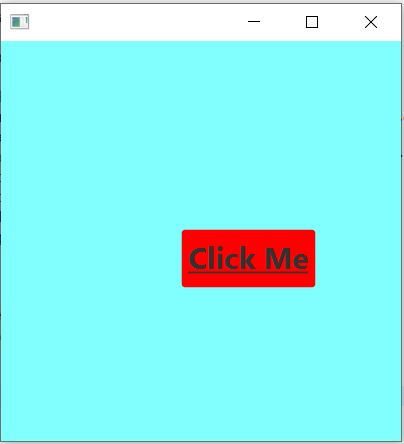
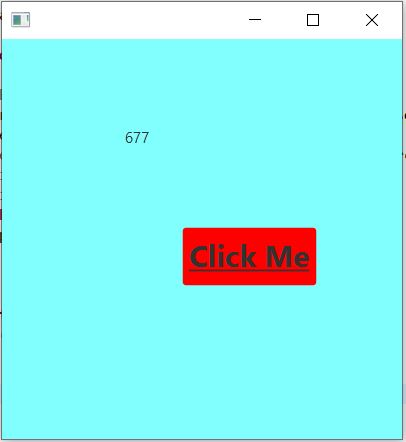
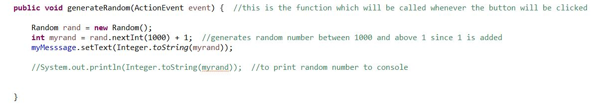

# Random Number Generator

A Random Number Generator built using JavaFX.

The FXML files have been designed using SceneBuilder.

On clicking the button 'Click Me' :

A random number between 1 and 1000 will be generated.

## Code Snippet :

The range of number generated can be changed in void generateRandom() function.
